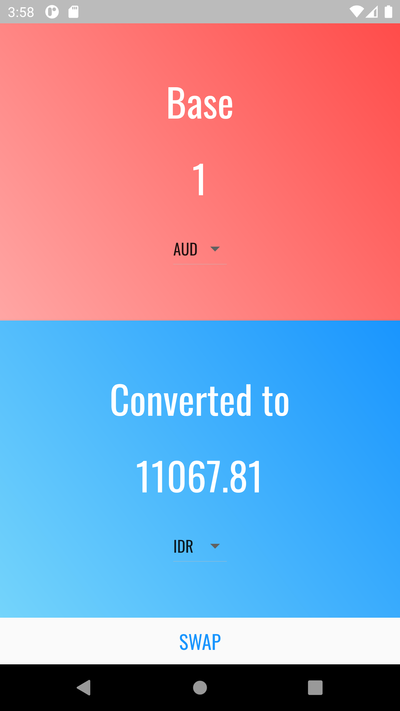
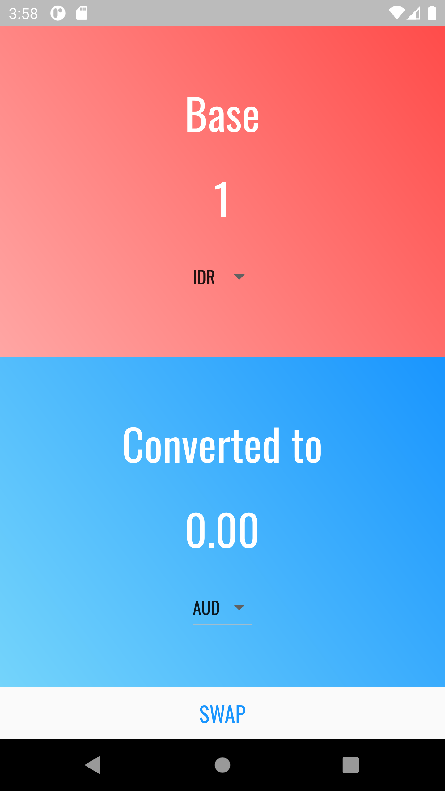

# currency_converter

A currency converter using The Free Currency Converter API, made with Flutter

Screenshots below ran on the Nexus 6 virtual device, not yet tested on an iOS device

Link to the API : <a href="https://free.currencyconverterapi.com/">Free Currency Converter</a>

Font : <a href="https://fonts.google.com/specimen/Oswald?query=oswald">Oswald</a>

<h2>Startup Screen</h2>

 
<h2>Loading</h2>

 
<h2>After Swapping</h2>

 
<h2>Currency Selection</h2>

